# Inventário do Data Lake - RJ SuperApp

## 📋 Visão Geral

Este documento descreve o inventário completo das tabelas e campos disponíveis no data lake do RJ SuperApp, organizados em dois datasets principais: **brutos_rmi** (sistema principal) e **brutos_go** (plataforma educacional).

**Data da Análise**: 18 de setembro de 2025

---

## 🏗️ Fluxograma da Arquitetura

```mermaid
---
title: Arquitetura do Data Lake - RJ SuperApp
---
flowchart TB
    %% Estilo das cores
    classDef rmiTable fill:#e1f5fe,stroke:#01579b,stroke-width:2px
    classDef goTable fill:#f3e5f5,stroke:#4a148c,stroke-width:2px
    classDef airbyte fill:#fff3e0,stroke:#e65100,stroke-width:2px
    classDef userFlow fill:#e8f5e8,stroke:#2e7d32,stroke-width:2px
    classDef tracking fill:#fff8e1,stroke:#f57f17,stroke-width:2px

    %% Fontes de Dados
    subgraph Sources["🔌 Fontes de Dados"]
        direction TB
        RMI_SRC["🏢 Sistema RMI<br/>(Sistema Principal)"]
        GO_SRC["🎓 Plataforma GO<br/>(Educacional)"]
    end

    %% Airbyte ETL
    subgraph ETL["⚙️ Camada ETL"]
        direction TB
        AIRBYTE["🔄 Airbyte<br/>Extract, Transform, Load"]
    end

    %% Data Lake Principal
    subgraph DataLake["🏗️ Data Lake - rj-superapp"]
        direction TB
        
        %% Dataset RMI
        subgraph RMI_DS["📊 Dataset: brutos_rmi"]
            direction TB
            
            subgraph Audit["🔍 Auditoria & Logs"]
                AUDIT_LOGS["📝 rmi_audit_logs<br/>• action, resource<br/>• timestamp<br/>• old_value/new_value<br/>• ip_address, user_agent"]:::rmiTable
            end
            
            subgraph UserMgmt["👤 Gestão de Usuários"]
                AVATARS["👤 rmi_avatars<br/>• Perfis completos<br/>• Dados pessoais<br/>• Endereços, contatos<br/>• Saúde, assistência social"]:::rmiTable
                
                USER_CONFIG["⚙️ rmi_users_config<br/>• Configurações<br/>• Preferências<br/>• created_at, updated_at"]:::rmiTable
                
                SELF_DECLARED["📋 rmi_self_declared<br/>• Dados autodeclarados<br/>• Informações fornecidas<br/>• pelo usuário"]:::rmiTable
            end
            
            subgraph Communication["📱 Comunicação"]
                OPT_HISTORY["📞 rmi_opt_in_history<br/>• action (opt-in/opt-out)<br/>• channel (SMS, WhatsApp)<br/>• reason, timestamp"]:::rmiTable
                
                PHONE_MAP["📱 rmi_phone_cpf_mappings<br/>• Mapeamento telefone-CPF<br/>• phone_number, cpf"]:::rmiTable
            end
            
            subgraph Testing["🧪 Testes"]
                BETA_GROUPS["🔬 rmi_beta_groups<br/>• beta_group_id<br/>• status<br/>• phone_number"]:::rmiTable
            end
        end
        
        %% Dataset GO
        subgraph GO_DS["📚 Dataset: brutos_go"]
            direction TB
            
            COURSES["📖 cursos<br/>• titulo, modalidade<br/>• data_inicio/termino<br/>• carga_horaria<br/>• facilitator, organizacao"]:::goTable
            
            ENROLLMENTS["✏️ inscricoes<br/>• cpf, curso_id<br/>• status, reason<br/>• enrolled_at<br/>• concluded_at<br/>• certificate_url"]:::goTable
        end
    end

    %% Camada de Tracking
    subgraph Tracking["📈 Camada de Tracking"]
        direction TB
        
        subgraph UserJourney["🗺️ Jornada do Usuário"]
            CROSS_PLATFORM["🔗 Cross-Platform<br/>CPF como chave única"]:::userFlow
            TIMELINE["⏰ Timeline de Eventos<br/>Timestamps estruturados"]:::userFlow
        end
        
        subgraph Events["📊 Eventos Rastreados"]
            RMI_EVENTS["🔍 Eventos RMI<br/>• Modificações de dados<br/>• Opt-in/opt-out<br/>• Ações administrativas<br/>• Participação beta"]:::tracking
            
            GO_EVENTS["🎓 Eventos GO<br/>• Inscrições<br/>• Progressão<br/>• Conclusões<br/>• Certificações"]:::tracking
        end
    end

    %% Identificadores Principais
    subgraph Identifiers["🔑 Identificadores Principais"]
        direction LR
        CPF["🆔 CPF<br/>Chave universal"]:::userFlow
        EMAIL["📧 Email<br/>ID secundário"]:::userFlow
        PHONE["📱 Telefone<br/>Comunicação"]:::userFlow
        INTERNAL_ID["🔢 IDs Internos<br/>_id, curso_id"]:::userFlow
    end

    %% Campos Temporais
    subgraph TimeFields["⏰ Dimensão Temporal"]
        direction LR
        AIRBYTE_TIME["🔄 Airbyte<br/>_airbyte_extracted_at"]:::airbyte
        RMI_TIME["📝 RMI<br/>timestamp (STRING)<br/>created_at, updated_at"]:::rmiTable
        GO_TIME["🎓 GO<br/>enrolled_at, concluded_at<br/>TIMESTAMP/DATETIME"]:::goTable
    end

    %% Casos de Uso
    subgraph UseCases["🎯 Casos de Uso Analytics"]
        direction TB
        
        ENGAGEMENT["📊 Análise de Engajamento<br/>• Taxa de conversão<br/>• Padrões temporais<br/>• Canais efetivos"]
        
        SEGMENTATION["👥 Segmentação<br/>• Beta vs Regular<br/>• Multi vs Single platform<br/>• Perfil demográfico"]
        
        FUNNEL["🚀 Funel de Conversão<br/>• Inscrição → Conclusão<br/>• Tempo médio<br/>• Taxa de abandono"]
        
        COMMUNICATION["📢 Efetividade Comunicação<br/>• Opt-in/opt-out patterns<br/>• Canal preferencial<br/>• Resposta a campanhas"]
    end

    %% Conexões principais
    RMI_SRC --> AIRBYTE
    GO_SRC --> AIRBYTE
    AIRBYTE --> DataLake
    
    %% Relacionamentos internos
    AUDIT_LOGS -.->|CPF| AVATARS
    AVATARS -.->|CPF| OPT_HISTORY
    PHONE_MAP -.->|CPF| AVATARS
    BETA_GROUPS -.->|CPF| AVATARS
    
    ENROLLMENTS -.->|curso_id| COURSES
    ENROLLMENTS -.->|CPF| AVATARS
    
    %% Tracking flows
    DataLake --> Tracking
    Tracking --> UseCases
    
    %% Identificadores
    CPF -.->|Liga todas<br/>as tabelas| DataLake
    EMAIL -.->|ID secundário| DataLake
    PHONE -.->|Comunicação| DataLake
    
    %% Temporal
    TimeFields -.->|Tracking temporal| Tracking

    %% Fluxo de eventos principais
    AUDIT_LOGS -->|Eventos de sistema| RMI_EVENTS
    OPT_HISTORY -->|Eventos comunicação| RMI_EVENTS
    BETA_GROUPS -->|Eventos teste| RMI_EVENTS
    
    ENROLLMENTS -->|Eventos educacionais| GO_EVENTS
    COURSES -->|Contexto educacional| GO_EVENTS
    
    RMI_EVENTS --> CROSS_PLATFORM
    GO_EVENTS --> CROSS_PLATFORM
    
    CROSS_PLATFORM --> ENGAGEMENT
    CROSS_PLATFORM --> SEGMENTATION
    CROSS_PLATFORM --> FUNNEL
    CROSS_PLATFORM --> COMMUNICATION
```



---

## 🔗 Diagrama de Entidade-Relacionamento (ERD)

O diagrama ERD abaixo mostra as relações entre as entidades do data lake, destacando as chaves primárias, estrangeiras e os relacionamentos:

```mermaid
---
title: Diagrama de Entidade-Relacionamento - RJ SuperApp Data Lake
---
erDiagram
    %% Estilos para diferentes tipos de tabelas
    classDef rmiCore fill:#e3f2fd,stroke:#1976d2,stroke-width:2px
    classDef rmiAudit fill:#fff3e0,stroke:#f57c00,stroke-width:2px
    classDef goEducation fill:#f3e5f5,stroke:#7b1fa2,stroke-width:2px
    classDef mapping fill:#e8f5e8,stroke:#388e3c,stroke-width:2px

    %% ========================================
    %% ENTIDADES RMI - SISTEMA PRINCIPAL
    %% ========================================
    
    RMI-AVATARS:::rmiCore {
        string _id PK
        string cpf UK "CPF - Chave de ligação universal"
        string name
        string nome
        string raca
        string sexo
        json mae_cpf
        string mae_nome
        bool menor_idade
        string nascimento_data
        string nascimento_uf
        string nascimento_pais
        string nascimento_municipio
        bool obito_indicador
        int obito_ano
        json email_principal
        string email_principal_valor
        json telefone_principal
        string telefone_principal_valor
        string telefone_principal_ddd
        json endereco_principal
        string endereco_principal_cep
        string endereco_principal_bairro
        string endereco_principal_municipio
        string endereco_principal_logradouro
        bool assistencia_social_cadunico_indicador
        string assistencia_social_cras_nome
        bool saude_clinica_familia_indicador
        string saude_clinica_familia_nome
        string datalake_last_updated
    }

    RMI-AUDIT-LOGS:::rmiAudit {
        string _airbyte_raw_id PK
        timestamp _airbyte_extracted_at
        string _id
        string cpf FK "Referência ao usuário"
        string action "Tipo de ação realizada"
        string resource "Recurso afetado"
        string old_value "Valor anterior"
        string new_value "Valor novo"
        string timestamp "Timestamp da ação"
        string ip_address "IP do usuário"
        string user_agent "User agent"
        string request_id "ID da requisição"
        string metadata_field
        string metadata_operation
    }

    RMI-OPT-IN-HISTORY:::rmiAudit {
        string _airbyte_raw_id PK
        timestamp _airbyte_extracted_at
        string _id
        string cpf FK "Referência ao usuário"
        string action "opt-in ou opt-out"
        string channel "SMS, WhatsApp, Email"
        string reason "Motivo da ação"
        string phone_number
        string timestamp "Timestamp da ação"
    }

    RMI-BETA-GROUPS:::rmiCore {
        string _airbyte_raw_id PK
        timestamp _airbyte_extracted_at
        string _id
        string cpf FK "Referência ao usuário"
        string status "Status no grupo beta"
        string phone_number
        string beta_group_id "ID do grupo beta"
        string created_at
        string updated_at
    }

    RMI-PHONE-CPF-MAPPINGS:::mapping {
        string _airbyte_raw_id PK
        timestamp _airbyte_extracted_at
        string _id
        string cpf FK "Referência ao usuário"
        string nome
        string phone_number "Número de telefone"
    }

    RMI-SELF-DECLARED:::rmiCore {
        string _airbyte_raw_id PK
        timestamp _airbyte_extracted_at
        string _id
        string cpf FK "Referência ao usuário"
        string name
        string created_at
        string updated_at
    }

    RMI-USERS-CONFIG:::rmiCore {
        string _airbyte_raw_id PK
        timestamp _airbyte_extracted_at
        string _id
        string name
        string cpf FK "Referência ao usuário"
        string created_at
        string updated_at
    }

    %% ========================================
    %% ENTIDADES GO - PLATAFORMA EDUCACIONAL
    %% ========================================

    GO-CURSOS:::goEducation {
        int id PK "ID único do curso"
        string titulo "Título do curso"
        string theme "Tema/categoria"
        string modalidade "Presencial/Online/Híbrido"
        string turno "Manhã/Tarde/Noite"
        int carga_horaria "Horas totais"
        int numero_vagas "Vagas disponíveis"
        datetime data_inicio "Data de início"
        datetime data_termino "Data de término"
        timestamp enrollment_start_date "Início inscrições"
        timestamp enrollment_end_date "Fim inscrições"
        string descricao "Descrição do curso"
        string objectives "Objetivos"
        string methodology "Metodologia"
        string facilitator "Instrutor/Facilitador"
        string organization "Organização responsável"
        int orgao_id "ID do órgão"
        int instituicao_id "ID da instituição"
        string local_realizacao "Local"
        bool has_certificate "Oferece certificado"
        string status "Ativo/Inativo/Cancelado"
        timestamp created_at
        timestamp updated_at
    }

    GO-INSCRICOES:::goEducation {
        string _airbyte_raw_id PK
        timestamp _airbyte_extracted_at
        string id "ID da inscrição"
        string cpf FK "CPF do usuário"
        int curso_id FK "ID do curso"
        string name "Nome do usuário"
        string email "Email do usuário"
        string phone "Telefone do usuário"
        string status "Inscrito/Concluído/Cancelado"
        string reason "Motivo/observações"
        timestamp enrolled_at "Data de inscrição"
        timestamp concluded_at "Data de conclusão"
        timestamp updated_at "Última atualização"
        string certificate_url "URL do certificado"
        string admin_notes "Notas administrativas"
        string custom_fields_data "Dados customizados"
    }

    %% ========================================
    %% RELACIONAMENTOS
    %% ========================================

    %% Relacionamentos principais por CPF
    RMI-AVATARS ||--o{ RMI-AUDIT-LOGS : "gera eventos"
    RMI-AVATARS ||--o{ RMI-OPT-IN-HISTORY : "possui histórico"
    RMI-AVATARS ||--o{ RMI-BETA-GROUPS : "participa de"
    RMI-AVATARS ||--o{ RMI-PHONE-CPF-MAPPINGS : "tem telefones"
    RMI-AVATARS ||--o{ RMI-SELF-DECLARED : "declara dados"
    RMI-AVATARS ||--o{ RMI-USERS-CONFIG : "possui configurações"
    
    %% Cross-platform: RMI para GO
    RMI-AVATARS ||--o{ GO-INSCRICOES : "se inscreve em"
    
    %% Relacionamento curso-inscrição
    GO-CURSOS ||--o{ GO-INSCRICOES : "recebe inscrições"

    %% ========================================
    %% ENTIDADES CONCEITUAIS (TRACKING)
    %% ========================================

    USER-JOURNEY {
        string cpf PK, FK "Chave universal"
        string platform "RMI, GO, BOTH"
        timestamp first_interaction "Primeira interação"
        timestamp last_interaction "Última interação"
        int total_actions "Total de ações"
        int total_courses "Total de cursos"
        string engagement_level "Alto, Médio, Baixo"
    }

    %% Relacionamento conceitual com jornada
    RMI-AVATARS ||--|| USER-JOURNEY : "possui jornada"
    GO-INSCRICOES }o--|| USER-JOURNEY : "contribui para"
```



### 🔑 Legenda do ERD

| Cor | Tipo de Entidade | Descrição |
|-----|------------------|-----------|
| 🔵 **Azul** | RMI Core | Entidades principais do sistema RMI |
| 🟠 **Laranja** | RMI Audit | Tabelas de auditoria e logs |
| 🟣 **Roxo** | GO Education | Plataforma educacional |
| 🟢 **Verde** | Mapping | Tabelas de mapeamento e relacionamento |

### 📊 Cardinalidades dos Relacionamentos

| Relacionamento | Cardinalidade | Descrição |
|----------------|---------------|-----------|
| `RMI-AVATARS` → `RMI-AUDIT-LOGS` | 1:N | Um usuário pode gerar múltiplos eventos de auditoria |
| `RMI-AVATARS` → `RMI-OPT-IN-HISTORY` | 1:N | Um usuário pode ter múltiplas ações de opt-in/opt-out |
| `RMI-AVATARS` → `GO-INSCRICOES` | 1:N | Um usuário pode se inscrever em múltiplos cursos |
| `GO-CURSOS` → `GO-INSCRICOES` | 1:N | Um curso pode ter múltiplas inscrições |
| `RMI-AVATARS` → `USER-JOURNEY` | 1:1 | Cada usuário possui uma jornada única |

### 🎯 Principais Insights do ERD

1. **CPF como Chave Universal**: O campo `cpf` conecta todos os sistemas, permitindo tracking cross-platform
2. **Separação Lógica**: Entidades RMI focam em gestão de usuários e auditoria, enquanto GO foca em educação
3. **Rastreabilidade Completa**: Logs de auditoria capturam todas as mudanças no sistema
4. **Jornada do Usuário**: Entidade conceitual `USER-JOURNEY` consolida informações de ambas as plataformas

---

## 🏗️ Arquitetura dos Datasets

### Dataset: `rj-superapp.brutos_rmi`
**Descrição**: Sistema principal de gestão de usuários e interações
**Tabelas**: 7 tabelas
**Funcionalidade**: Tracking de usuários, auditoria, comunicação, perfis

### Dataset: `rj-superapp.brutos_go`
**Descrição**: Plataforma educacional e de cursos
**Tabelas**: 2 tabelas  
**Funcionalidade**: Gestão de cursos e inscrições

---

## 📊 Inventário Detalhado de Tabelas

### 🔧 brutos_rmi - Sistema Principal

#### 1. `rmi_audit_logs` - Logs de Auditoria
**Propósito**: Rastreamento de todas as ações e modificações no sistema

| Campo | Tipo | Nullable | Descrição |
|-------|------|----------|-----------|
| **Campos Airbyte** | | | |
| `_airbyte_raw_id` | STRING | NO | ID único do registro Airbyte |
| `_airbyte_extracted_at` | TIMESTAMP | NO | Timestamp de extração |
| `_airbyte_meta` | JSON | NO | Metadados Airbyte |
| `_airbyte_generation_id` | INT64 | YES | ID da geração Airbyte |
| **Identificadores** | | | |
| `_id` | STRING | YES | ID interno do registro |
| `cpf` | STRING | YES | 🔑 CPF do usuário |
| **Dados de Auditoria** | | | |
| `action` | STRING | YES | 📝 Tipo de ação realizada |
| `resource` | STRING | YES | 📂 Recurso afetado |
| `old_value` | STRING | YES | Valor anterior |
| `new_value` | STRING | YES | Valor novo |
| `timestamp` | STRING | YES | ⏰ Timestamp da ação |
| `ip_address` | STRING | YES | IP do usuário |
| `user_agent` | STRING | YES | User agent do navegador |
| `request_id` | STRING | YES | ID da requisição |
| **Metadados** | | | |
| `metadata_field` | STRING | YES | Campo de metadados |
| `metadata_phone` | STRING | YES | Telefone nos metadados |
| `metadata_operation` | STRING | YES | Tipo de operação |

**Eventos Rastreados**:
- Modificações de dados pessoais
- Alterações de endereço
- Mudanças de telefone/email
- Atualizações de status

---

#### 2. `rmi_avatars` - Perfis de Usuários
**Propósito**: Gestão de perfis e avatares dos usuários

| Categoria | Campos |
|-----------|--------|
| **Identificação** | `_id`, `cpf`, `name`, `nome` |
| **Dados Pessoais** | `raca`, `sexo`, `mae_nome`, `nascimento_*` |
| **Endereço** | `endereco_principal_*`, `endereco_alternativo` |
| **Contato** | `email_principal_*`, `telefone_principal_*` |
| **Saúde** | `saude_clinica_familia_*`, `saude_equipe_*` |
| **Assistência Social** | `assistencia_social_*`, `bolsa_familia_*` |
| **Auditoria** | `created_at`, `updated_at`, `datalake_last_updated` |

---

#### 3. `rmi_beta_groups` - Grupos Beta
**Propósito**: Gestão de usuários em grupos de teste

| Campo | Tipo | Descrição |
|-------|------|-----------|
| `cpf` | STRING | 🔑 CPF do usuário |
| `status` | STRING | Status no grupo beta |
| `phone_number` | STRING | Telefone de contato |
| `beta_group_id` | STRING | 🎯 ID do grupo beta |
| `created_at` | STRING | ⏰ Data de entrada |
| `updated_at` | STRING | ⏰ Última atualização |

---

#### 4. `rmi_opt_in_history` - Histórico de Consentimento
**Propósito**: Rastreamento de opt-in/opt-out de comunicações

| Campo | Tipo | Descrição |
|-------|------|-----------|
| `cpf` | STRING | 🔑 CPF do usuário |
| `action` | STRING | 📱 Ação (opt-in/opt-out) |
| `channel` | STRING | 📢 Canal de comunicação |
| `reason` | STRING | Motivo da ação |
| `phone_number` | STRING | Número de telefone |
| `timestamp` | STRING | ⏰ Timestamp da ação |

**Canais Rastreados**:
- SMS
- WhatsApp
- Email
- Push notifications

---

#### 5. `rmi_phone_cpf_mappings` - Mapeamento Telefone-CPF
**Propósito**: Relacionamento entre números de telefone e CPFs

| Campo | Tipo | Descrição |
|-------|------|-----------|
| `_id` | STRING | ID interno |
| `cpf` | STRING | 🔑 CPF do usuário |
| `nome` | STRING | Nome do usuário |
| `phone_number` | STRING | 📞 Número de telefone |

---

#### 6. `rmi_self_declared` - Dados Autodeclarados
**Propósito**: Informações fornecidas diretamente pelos usuários

| Campo | Tipo | Descrição |
|-------|------|-----------|
| `_id` | STRING | ID interno |
| `cpf` | STRING | 🔑 CPF do usuário |
| Demais campos seguem padrão similar aos outros |

---

#### 7. `rmi_users_config` - Configurações de Usuários
**Propósito**: Preferências e configurações dos usuários

| Campo | Tipo | Descrição |
|-------|------|-----------|
| `_id` | STRING | ID interno |
| `name` | STRING | Nome do usuário |
| `created_at` | STRING | ⏰ Data de criação |
| `updated_at` | STRING | ⏰ Última atualização |

---

### 🎓 brutos_go - Plataforma Educacional

#### 1. `inscricoes` - Inscrições em Cursos
**Propósito**: Gestão de inscrições e jornada educacional

| Campo | Tipo | Nullable | Descrição |
|-------|------|----------|-----------|
| **Identificadores** | | | |
| `id` | STRING | YES | 🔑 ID da inscrição |
| `cpf` | STRING | YES | 🔑 CPF do usuário |
| `curso_id` | INT64 | YES | 🔗 ID do curso |
| **Dados Pessoais** | | | |
| `name` | STRING | YES | Nome do usuário |
| `email` | STRING | YES | 📧 Email do usuário |
| `phone` | STRING | YES | 📞 Telefone do usuário |
| **Status da Inscrição** | | | |
| `status` | STRING | YES | 📊 Status atual |
| `reason` | STRING | YES | Motivo/observações |
| `admin_notes` | STRING | YES | Notas administrativas |
| **Timeline Educacional** | | | |
| `enrolled_at` | TIMESTAMP | YES | ⏰ Data de inscrição |
| `concluded_at` | TIMESTAMP | YES | ⏰ Data de conclusão |
| `updated_at` | TIMESTAMP | YES | ⏰ Última atualização |
| **Certificação** | | | |
| `certificate_url` | STRING | YES | 🏆 URL do certificado |
| `custom_fields_data` | STRING | YES | Dados customizados |

**Status Possíveis**:
- Inscrito
- Em andamento
- Concluído
- Cancelado
- Suspenso

---

#### 2. `cursos` - Catálogo de Cursos
**Propósito**: Informações detalhadas sobre os cursos oferecidos

| Campo | Tipo | Nullable | Descrição |
|-------|------|----------|-----------|
| **Identificação** | | | |
| `id` | INT64 | YES | 🔑 ID único do curso |
| `titulo` | STRING | YES | 📚 Título do curso |
| `theme` | STRING | YES | Tema/categoria |
| **Configuração Acadêmica** | | | |
| `modalidade` | STRING | YES | 🎯 Modalidade (presencial/online) |
| `turno` | STRING | YES | Turno de oferecimento |
| `carga_horaria` | INT64 | YES | ⏱️ Carga horária total |
| `numero_vagas` | INT64 | YES | 👥 Número de vagas |
| **Cronograma** | | | |
| `data_inicio` | DATETIME | YES | ⏰ Data de início |
| `data_termino` | DATETIME | YES | ⏰ Data de término |
| `enrollment_start_date` | TIMESTAMP | YES | 📝 Início das inscrições |
| `enrollment_end_date` | TIMESTAMP | YES | 📝 Fim das inscrições |
| `data_limite_inscricoes` | DATETIME | YES | ⚠️ Limite para inscrições |
| **Conteúdo e Metodologia** | | | |
| `descricao` | STRING | YES | Descrição do curso |
| `objectives` | STRING | YES | Objetivos de aprendizagem |
| `methodology` | STRING | YES | Metodologia aplicada |
| `program_content` | STRING | YES | Conteúdo programático |
| `target_audience` | STRING | YES | 🎯 Público-alvo |
| `pre_requisitos` | STRING | YES | Pré-requisitos |
| **Recursos e Materiais** | | | |
| `material_used` | STRING | YES | Materiais utilizados |
| `teaching_material` | STRING | YES | Material didático |
| `resources_used` | STRING | YES | Recursos pedagógicos |
| `formato_aula` | STRING | YES | Formato das aulas |
| **Informações Administrativas** | | | |
| `facilitator` | STRING | YES | 👨‍🏫 Facilitador/Instrutor |
| `organization` | STRING | YES | 🏢 Organização responsável |
| `orgao_id` | INT64 | YES | ID do órgão |
| `instituicao_id` | INT64 | YES | ID da instituição |
| `local_realizacao` | STRING | YES | 📍 Local de realização |
| **Certificação** | | | |
| `has_certificate` | BOOL | YES | ✅ Oferece certificado |
| `certificacao_oferecida` | BOOL | YES | Certificação disponível |
| **Contato e Mídia** | | | |
| `contato_duvidas` | STRING | YES | 📞 Contato para dúvidas |
| `link_inscricao` | STRING | YES | 🔗 Link de inscrição |
| `cover_image` | STRING | YES | 🖼️ Imagem de capa |
| `institutional_logo` | STRING | YES | Logo institucional |
| **Auditoria** | | | |
| `status` | STRING | YES | 📊 Status do curso |
| `created_at` | TIMESTAMP | YES | ⏰ Data de criação |
| `updated_at` | TIMESTAMP | YES | ⏰ Última atualização |

---

## 🔗 Relacionamentos Entre Tabelas

### Chaves Primárias de Ligação

1. **CPF** - Identificador universal de usuário
   - Presente em: Todas as tabelas RMI + `inscricoes`
   - Permite tracking cross-platform

2. **curso_id** - Relacionamento curso-inscrição
   - `inscricoes.curso_id` → `cursos.id`
   - Relacionamento 1:N (um curso, várias inscrições)

3. **phone_number** - Identificador secundário
   - Presente em: `rmi_opt_in_history`, `rmi_beta_groups`, `rmi_phone_cpf_mappings`

### Campos Temporais por Contexto

| Contexto | Campos | Formato |
|----------|--------|---------|
| **Auditoria** | `timestamp`, `created_at`, `updated_at` | STRING |
| **Educacional** | `enrolled_at`, `concluded_at`, `data_inicio` | TIMESTAMP/DATETIME |
| **Sistema** | `_airbyte_extracted_at`, `datalake_last_updated` | TIMESTAMP/STRING |

---

## 📈 Eventos de Tracking Identificados

### 🔍 RMI - Sistema Principal

| Tabela | Eventos | Campos Chave |
|--------|---------|--------------|
| `rmi_audit_logs` | Modificações de dados | `action`, `resource`, `timestamp` |
| `rmi_opt_in_history` | Consentimento comunicação | `action`, `channel`, `reason` |
| `rmi_beta_groups` | Participação em testes | `status`, `beta_group_id` |
| `rmi_avatars` | Criação/atualização perfil | `created_at`, `updated_at` |

### 🎓 GO - Plataforma Educacional

| Tabela | Eventos | Campos Chave |
|--------|---------|--------------|
| `inscricoes` | Jornada educacional | `enrolled_at`, `concluded_at`, `status` |
| `cursos` | Gestão de ofertas | `enrollment_start_date`, `enrollment_end_date` |

---

## 🎯 Casos de Uso de Tracking

### 1. **Jornada do Usuário Cross-Platform**
```sql
-- Exemplo: Usuários que se inscreveram em cursos após ações no RMI
SELECT r.cpf, r.action, r.timestamp, g.enrolled_at, c.titulo
FROM `rj-superapp.brutos_rmi.rmi_audit_logs` r
JOIN `rj-superapp.brutos_go.inscricoes` g ON r.cpf = g.cpf
JOIN `rj-superapp.brutos_go.cursos` c ON g.curso_id = c.id
WHERE timestamp (r.timestamp) < g.enrolled_at
```

### 2. **Análise de Engajamento**
- Taxa de opt-out por canal
- Conversão de inscrição para conclusão
- Atividade por horário/dia da semana

### 3. **Segmentação de Usuários**
- Usuários beta vs. regulares
- Multi-platform vs. single-platform
- Engajamento educacional por perfil demográfico

### 4. **Análise de Comunicação**
- Efetividade de canais por público
- Padrões de opt-in/opt-out
- Resposta a campanhas

---

## ⚠️ Considerações Técnicas

### Formato de Dados
- **RMI**: Timestamps em formato STRING (requer parsing)
- **GO**: Timestamps estruturados (TIMESTAMP/DATETIME)
- **JSON**: Campos aninhados requerem parsing específico

### Qualidade dos Dados
- Campos nullable: Verificar completude antes da análise
- CPF: Campo chave para ligação entre sistemas
- Timestamps: Validar consistência temporal

### Performance
- Índices recomendados: `cpf`, `timestamp`, `curso_id`
- Particionamento por data para tabelas de log
- Considerar materialização de views para consultas frequentes

---

## 📋 Próximos Passos

1. **Validação de Dados**
   - Verificar completude dos CPFs
   - Validar consistência temporal
   - Identificar possíveis duplicatas

2. **Modelagem Analytics**
   - Criar tabelas fato/dimensão
   - Implementar SCD para tracking histórico
   - Desenvolver métricas de negócio

3. **Dashboards e Monitoramento**
   - KPIs de engajamento
   - Funnel de conversão educacional
   - Alertas de qualidade de dados

---

**Documento gerado em**: 18 de setembro de 2025  
**Versão**: 1.0  
**Última atualização**: Análise inicial do esquema